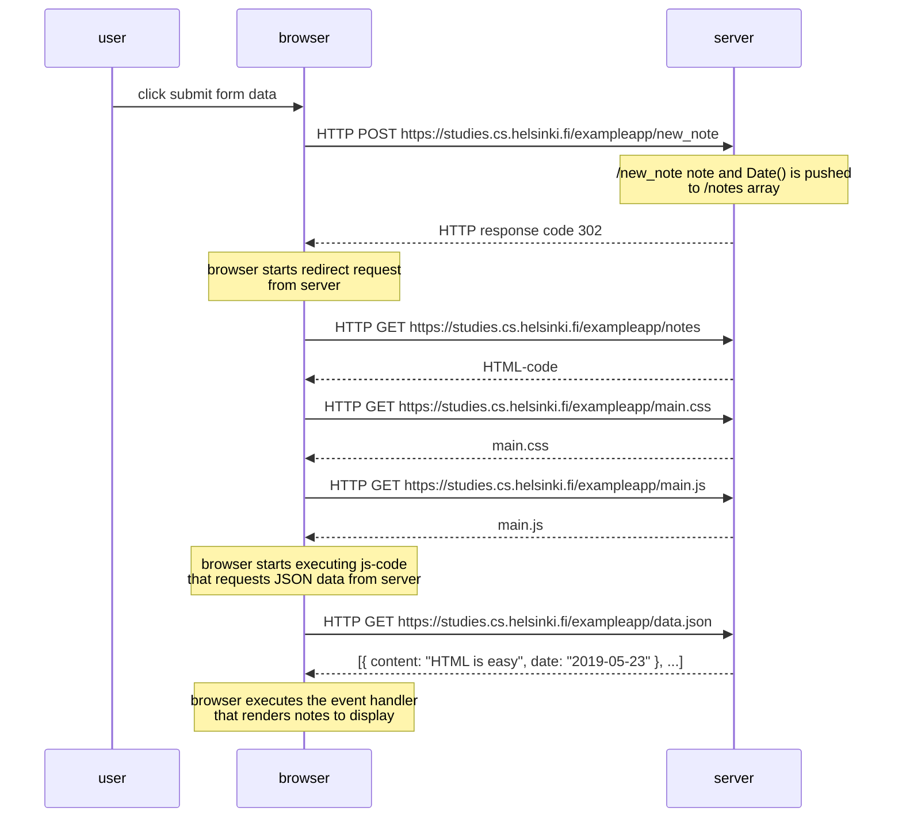

```mermaid

sequenceDiagram 
    participant user
    participant browser
    participant server

    user ->> browser: click submit form data
    browser ->> server: HTTP POST https://studies.cs.helsinki.fi/exampleapp/new_note
    note over server: /new_note note and Date() is pushed <br/>to /notes array
    server -->> browser: HTTP response code 302 
    note over browser: browser starts redirect request <br/>from server

    browser ->> server: HTTP GET https://studies.cs.helsinki.fi/exampleapp/notes
    server -->> browser: HTML-code
    
    browser ->> server: HTTP GET https://studies.cs.helsinki.fi/exampleapp/main.css
    server -->> browser: main.css
    
    browser ->> server: HTTP GET https://studies.cs.helsinki.fi/exampleapp/main.js
    server -->> browser: main.js
    note over browser: browser starts executing js-code <br/>that requests JSON data from server

    browser ->> server: HTTP GET https://studies.cs.helsinki.fi/exampleapp/data.json
    server -->> browser: [{ content: "HTML is easy", date: "2019-05-23" }, ...]
    note over browser: browser executes the event handler <br/>that renders notes to display

```