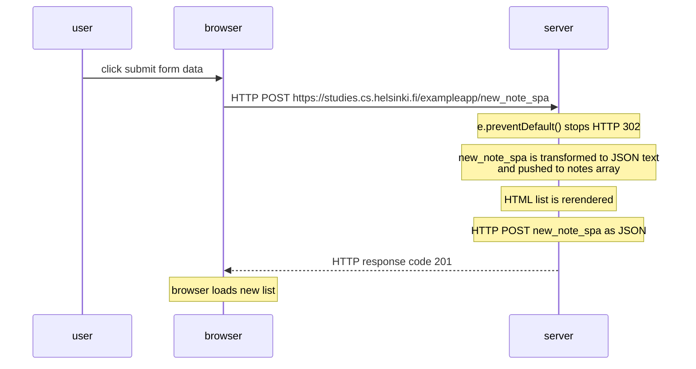

```mermaid

sequenceDiagram 
    participant user
    participant browser
    participant server

    user ->> browser: click submit form data
    browser ->> server: HTTP POST https://studies.cs.helsinki.fi/exampleapp/new_note_spa
    note over server: e.preventDefault() stops HTTP 302
    note over server: new_note_spa is transformed to JSON text <br/>and pushed to notes array
    note over server: HTML list is rerendered
    note over server: HTTP POST new_note_spa as JSON
    server -->> browser: HTTP response code 201
    note over browser: browser loads new list

```